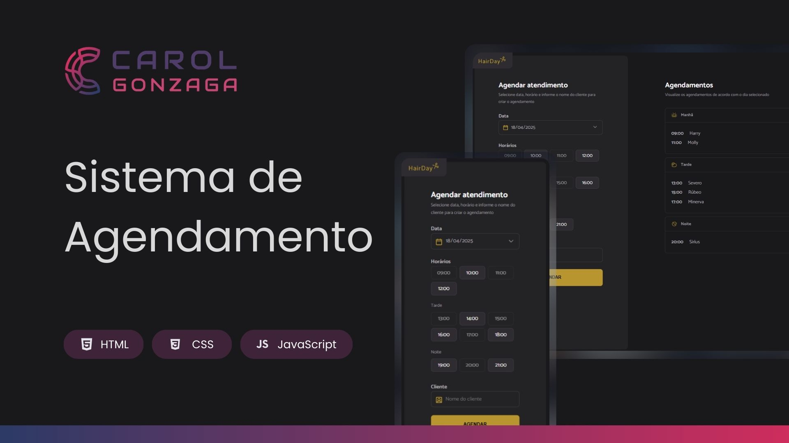

  

 

Uma aplicação de agendamento de cortes de cabelo com abordagem totalmente responsiva e integração com API simulada.

  <a href="#-tecnologias">Tecnologias</a>&nbsp;&nbsp;&nbsp;|&nbsp;&nbsp;&nbsp;
  <a href="#-objetivo">Objetivo</a>&nbsp;&nbsp;&nbsp;|&nbsp;&nbsp;&nbsp;
  <a href="#-funcionalidades">Funcionalidades</a>&nbsp;&nbsp;&nbsp;|&nbsp;&nbsp;&nbsp;
  <a href="https://seu-link-deploy.vercel.app" target="_blank">Acesse o Projeto</a>

 
 

  

 
 

## 🚀 Tecnologias

Esse projeto foi desenvolvido com as seguintes tecnologias:

-   HTML5
-   CSS3 (com abordagem mobile-first e responsividade)
-   JavaScript (ES6+)
-   Webpack
-   Babel
-   Day.js
-   JSON Server (simulando uma API REST)

 
 

## 🎯 Objetivo

O objetivo deste projeto é colocar em prática conceitos fundamentais de desenvolvimento front-end moderno, como:

-   Manipulação do DOM com JavaScript
-   Consumo de API REST (GET, POST, DELETE)
-   Organização de código em módulos
-   Estrutura de projeto real com Webpack e Babel
-   Estruturação e separação por responsabilidades (serviços, módulos e utilitários)
-   Responsividade para diferentes tamanhos de tela

 
 

## 🛠️ Funcionalidades

A aplicação permite que o usuário:

-   Insira o nome do cliente e selecione uma data e hora disponíveis para o corte
-   Visualize os agendamentos divididos por período do dia (manhã, tarde, noite)
-   Cancele agendamentos com confirmação
-   Veja os horários disponíveis atualizados em tempo real com base nas escolhas
-   Interaja com uma interface leve, responsiva e intuitiva
